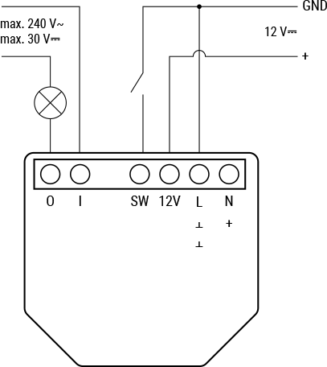
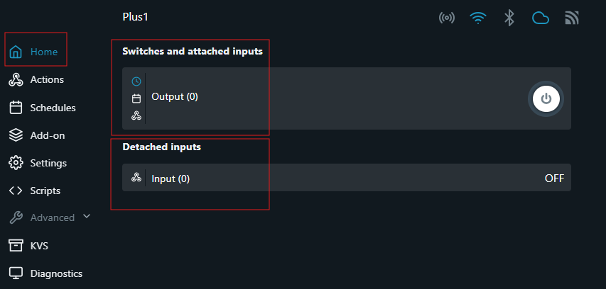
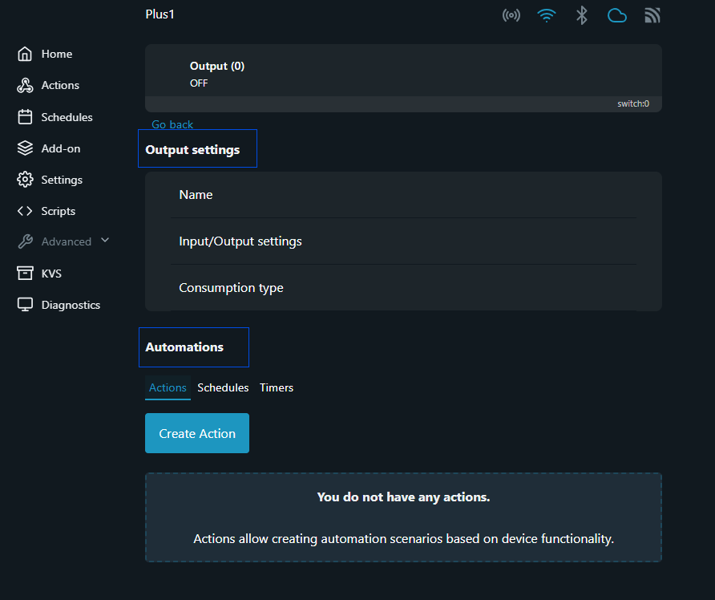

  

# Homebridge Shelly Door Controller

Hi there! 👋  
This Homebridge plugin lets you use your **Shelly Plus 1** as a door controller in HomeKit.  
Tested with: [Shelly Plus 1](https://www.shelly.com/products/shelly-plus-1-x1) 🔗

## 🪛 Wiring

## ⚙️ Shelly Device Setup

Follow these steps to configure your Shelly as a **momentary switch**:

1. **Access Device**  
   - Open your Shelly’s IP address in a browser

2. **Switches and Attached Inputs** *(see red rectangle in image below)*  
   - Find the **Switches and Attached Inputs** section  
   - Click **Output(0)** row  
     - In **Output Settings** *(see blue rectangle in image below)*:  
       - Go to **Input/Output Settings** row  
         - Set **Select input mode for Input(0)**: `Switch`  
         - **Set output type for Output(0)**: `Detached - Input is separated/not changing state of the output/relay`  
         - Set **Action on power on for Output(0)**: `Turn OFF`  
     - In **Automations** *(see blue rectangle in image below)*:  
       - Go to the **Timers** tab  
       - Set **Auto ON**: `0`  
       - Set **Auto OFF**: `0.5`

3. **Detached Inputs** *(see red rectangle in image below)*  
   - Click the existing input  
   - Ensure **Enable** is checked  
   - *(Optional)* If your contact sensor is **NO (Normally Open)**, enable **Invert Input**.  
     If **NC (Normally Closed)**, leave it disabled.

---

## 🧩 Homebridge Plugin Configuration

| Setting                  | Description                                                                                                                                      |
|--------------------------|--------------------------------------------------------------------------------------------------------------------------------------------------|
| **Device ID**            | Find under `Settings > Device Settings > Device Name` on the Shelly web UI. Use a unique ID (e.g., `shellyplus1-deviceID`) to avoid duplication. |
| **Name**                 | Friendly name as it will appear in HomeKit.                                                                                                     |
| **IP Address/Hostname**  | Local network IP or hostname for your Shelly device.                                                                                            |
| **Open Gate Time**       | Expected duration (in seconds) for the gate to open.                                                                                            |
| **Close Gate Time**      | Expected duration (in seconds) for the gate to close.                                                                                           |
| **Obstruction Detection**| Enables detection if the gate fails to close within the expected time. **Requires a contact sensor that monitors closed state.**              |

> ⚠️ **Note:**  
> For obstruction detection, you must connect a contact sensor to your Shelly device on the closed position of your gate/door.  
> If the plugin requests the door to close but the sensor does not confirm closure, an obstruction will be reported.

## 💡 Tips

- **🧲 Magnetic Contact Sensor:**  
  Without a contact sensor, the plugin can lose sync with the actual state of your gate/door—especially if your gate closes automatically after a set time.

- **🔄 Sensor Type:**  
  Configure the input inversion based on your sensor type (**NO** or **NC**) for accurate detection.

## 🎉 Enjoy seamless control of your gate or door with HomeKit! 🏡✨
